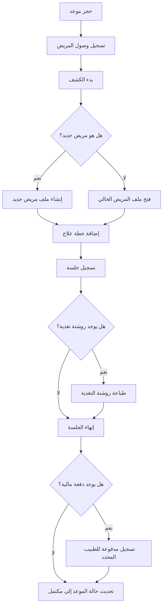
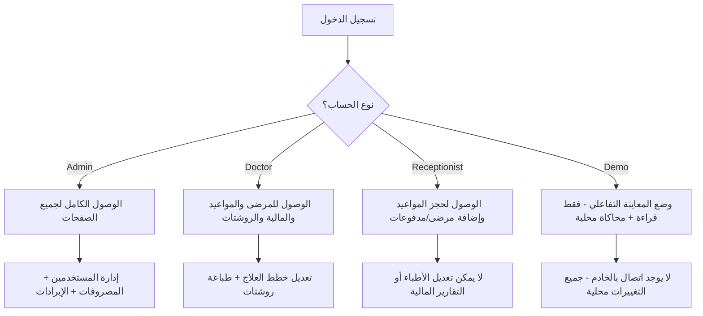
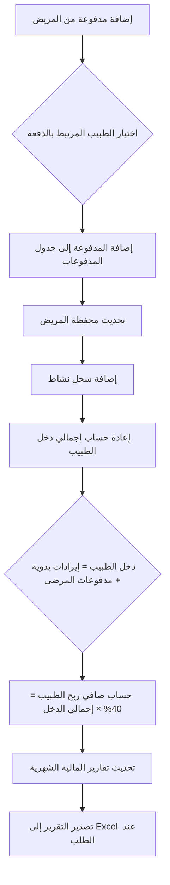

# 🩺 نظام إدارة مركز أثر (Athar Clinic Management System)

---

## 1. وصف المشروع

نظام إدارة متكامل لمراكز العلاج الطبيعي والتغذية العلاجية والتأهيل، تم تصميمه كـ **Progressive Web App (PWA)** ليتيح الوصول بدون اتصال بالإنترنت وإمكانية تثبيت التطبيق على شاشة الهاتف أو الكمبيوتر كتطبيق أصلي! يدعم النظام إدارة المرضى، حجز المواعيد، حسابات الأطباء الآلية (بقيمة 40% من دخلهم)، وإصدار تقرير مالي شهري تفصيلي قابل للتصدير إلى ملفات Excel بتنسيق احترافي.

---

## 2. المشكلة البرمجية والتجارية التي تم حلها

قبل تطوير نظام أثر، كان المركز يواجه تحديات حقيقية:
* **مشاكل الحسابات اليدوية:** كان يتم إجراء جميع العمليات الحسابية المعقدة للمرضى ونسب الأطباء يدوياً، وهي عملية مستهلكة للوقت ومعرضة للأخطاء البشرية بنسبة كبيرة.
* **استهلاك مفرط لمصادر Firebase Firestore:** كان النظام يعتمد على التحديثات الفورية المستمرة (Realtime Listeners) على جميع المجموعات بلا استثناء، مما أدى إلى استهلاك هائل في عمليات الاستعلام وقراءة البيانات (Reads/Writes)، وبالتالي ارتفاع تكلفة الخدمات السحابية بشكل غير مبرر.
* **عدم إمكانية العرض الآمن للعملاء:** لم تكن هناك طريقة آمنة لاستعراض لوحات التحكم والنظام أمام أصحاب المراكز والعملاء المحتملين دون إتاحة الوصول إلى البيانات الطبية والمالية الحقيقية أو المخاطرة بالتعديل عليها.

---

## 3. الحل الهندسي وتوفير التكلفة (Cost Optimization & Architecture)

تمت إعادة هيكلة المنطق البرمجي للنظام وتطبيق خطة حل مبتكرة تعتمد على:
* **المنطق الحاسوبي على جهاز العميل (Client-Side Logic):** تم نقل جميع العمليات الحسابية الثقيلة (مثل حساب أرباح الأطباء، صافي الدخل، والمصروفات) لتُعالج مباشرة على جانب العميل باستخدام (React)، مما قلل الحاجة إلى استعلامات Firestore المتكررة.
* **إدارة الحالة المحلية (React Local State & Context API):** تم بناء نظام إدارة حالة مرن يتيح تحديث وإعادة تصيير البيانات في واجهة المستخدم فوراً وبسلاسة تامة دون الحاجة لإرهاق الخادم بطلبات مستمرة.
* **التخزين المؤقت للبيانات (LocalStorage Caching):** تم تطبيق آلية ذكية لتخزين البيانات الأساسية التي يتم جلبها من Firestore مؤقتاً داخل الـ `localStorage` لجهاز المستخدم، مما خفّض عدد الاستعلامات وعمليات القراءة (Reads) بشكل ضخم جداً، ووفر في تكلفة البنية التحتية السحابية للعميل لتقترب من الصفر.
* **وضع المعاينة الآمن التفاعلي (Interactive Demo Mode):** تم ابتكار وضع عرض تفاعلي كامل بنسبة 100% يشحن التطبيق ببيانات تجريبية غنية (Mock Data) مخزنة محلياً. جميع العمليات من إضافة وحذف وتعديل في هذا الوضع تُحدث الذاكرة المؤقتة للمتصفح فقط (مع الحفظ المؤقت في `localStorage`)، مما يمنح الزائر تجربة حية وحقيقية للنظام مع عزل وحماية البيانات الفعلية للعيادة تماماً.

---

## 4. صلاحيات الأدوار (Multi-Role Authorization)

يدعم نظام أثر إدارة وتوزيع الصلاحيات عبر ثلاثة أدوار رئيسية بمستويات أمان صارمة:
* **👑 مدير المركز (Admin):**
  * الوصول الكامل لجميع الصفحات، الوظائف، والبيانات الحساسة.
  * إدارة حسابات المستخدمين (إضافة، تعديل، وحذف حسابات الأطباء وموظفي الاستقبال).
  * التحكم اليدوي في تسجيل وإدارة بنود المصروفات والإيرادات الخارجية.
  * استعراض التقارير المالية والتحليلات الشهرية الشاملة للمركز وتصديرها إلى Excel.
* **🩺 الطبيب (Doctor):**
  * عرض لوحة التحكم الخاصة به، والوصول لقوائم المرضى والمواعيد المتعلقة بحالاته.
  * إضافة وتعديل خطط العلاج، الجلسات، والروشتات الغذائية المخصصة لكل مريض.
  * تتبع محفظته المالية الشخصية وأرباحه المستحقة من الجلسات فورياً.
* **💻 موظف الاستقبال (Receptionist):**
  * تسجيل بيانات المرضى الجدد وفتح الملفات الأولية لهم.
  * حجز المواعيد وتنظيم جدول الزيارات القادمة.
  * تسجيل وتحصيل مدفوعات المرضى وتوجيه الحالات للعيادات المختصة.

---

## 5. المخططات الهندسية وسير العمل (System Architecture)

### 🔄 مخطط سير عمل المريض داخل المركز

### 🔐 هيكلية توزيع صلاحيات الأدوار والأمن السيبراني

### 💰 المنطق المالي وحساب النسب المؤتمتة (نظام الـ 40%)

---

## 6. لقطات الشاشة والمعاينة الفنية (Screenshots & Showcase)

* **لوحة التحكم الرئيسية**: واجهات تفاعلية متطورة تعرض رسوماً بيانية ذكية للأرباح ومعدلات نمو أعداد المرضى شهرياً.
* **ملفات المرضى**: صفحة متكاملة لإدارة السجلات الطبية، خطط العلاج الطبيعي، وتتبع المحفظة المالية والمدفوعات السابقة لكل حالة.
* **شاشة المواعيد والمرشحات**: جدول مرن لتنظيم الزيارات اليومية مع إمكانية تبديل حالة الموعد ديناميكياً (انتظار ← جارٍ ← مكتمل).
* **إدارة الحسابات والتقارير**: جدول مالي مؤتمت بالكامل يوضح مستحقات الطبيب (الـ 40% المستقطعة من إجمالي الدخل) مع خيار التصدير الفوري لملفات Excel المنسقة.

---

## 7. إخلاء مسؤولية وحقوق الملكية (Proprietary & Closed Source Notice)

⚠️ **إشعار هام وحقوق ملكية:**

هذا المشروع منتج تجاري مملوك، مصمم، ومطور بالكامل من قِبل المهندس إبراهيم أحمد، وهو نظام مغلق المصدر (Closed Source) وحقوق الملكية الفكرية والبرمجية له محفوظة بالكامل.

تم إنشاء وإعداد هذا المستودع (Repository) ليكون بمثابة معرض هندسي واستعراض فني (Portfolio Exhibition & Documentation) فقط. لا يحتوي المستودع على الكود المصدري الفعلي أو ملفات التشغيل البرمجية الحساسة للتطبيق؛ حيث تم حجب منطق التنفيذ الأساسي وقواعد البيانات لحماية الملكية الفكرية ومنع الاستخدام غير المصرح به.

---

## 🔗 روابط مهمة

* **النسخة الحية للتجربة والمعاينة (Live Demo)**: [https://athar412-a714d.web.app](https://athar412-a714d.web.app)
